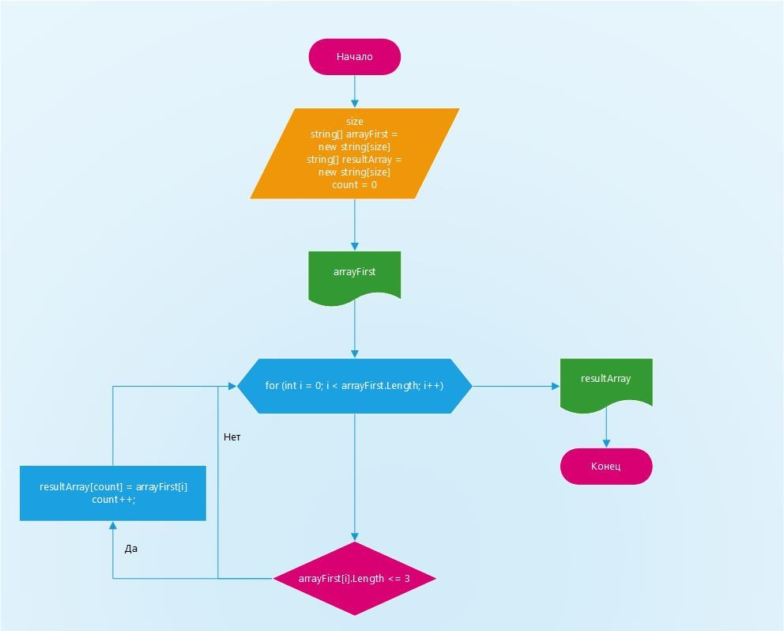

## Задача
### Написать программу, которая из имеющегося массива строк формирует новый массив из строк, длина которых меньше, либо равна 3 символам. Первоначальный массив можно ввести с клавиатуры, либо задать на старте выполнения алгоритма. При решении не рекомендуется пользоваться коллекциями, лучше обойтись исключительно массивами.

### Сначала программа просит ввести пользователя размерность массива. После того, как пользователь ввел размерность, программа просит ввести его значение строк массива и создает еще один массив равный первому. Первый массив выводится в терминале. Затем методом "NumberOfCharacters" осуществляется проверка условия "является ли число символов в элементе массива меньше или равным 3". Если да, то элемент заносится во второй массив, если нет, то нет.

## Блок-схема программы

